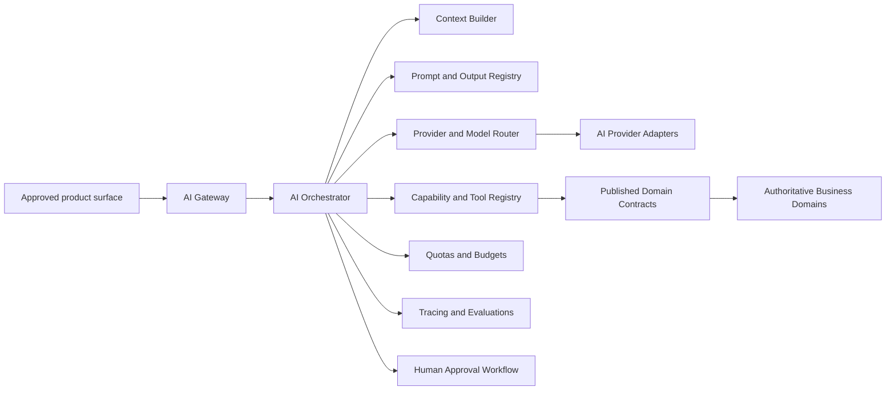

# AI platform architecture

## Purpose and authority

This document is the primary authority for Velora's AI platform boundary, Gateway, Orchestrator, provider/model abstraction, routing, prompt and output-version lifecycle, and asynchronous AI execution. It does not authorize product capabilities or replace [product phase authority](../product/01-product-phases.md).

AI is a first-class, isolated platform capability, not a business source-of-truth domain. It must never become source of truth for AUTH, USERS, DISCOVERY, MESSAGING, REALTIME, CREATORS, PRIVATE CLUBS, BILLING, PAYOUTS, TRUST & SAFETY, MODERATION, NOTIFICATIONS, ADMIN, or ANALYTICS.

## Ownership boundary

AI PLATFORM owns AI capability configuration, immutable prompt/output versions, provider/model routing policy, orchestration runs and checkpoints, AI-specific operational budgets, and derived AI stores described in the dedicated context document. It owns tool registry metadata, not domain tool implementations.

Owning business domains retain authorization, records, state transitions, policy, approval requirements, and audit truth. AI accesses them only through published contracts registered as tools. AI must not query or mutate another domain's private persistence.

## Logical architecture

Clients never call AI providers directly. Provider credentials and provider-native request objects remain inside configured adapters.

## Gateway responsibilities

The Gateway is the only application entry point for AI requests. It:

- authenticates the caller using AUTH-backed platform mechanisms;
- validates surface, capability, phase, actor, country/channel, request schema, and feature state;
- creates a run and correlation ID;
- applies request, concurrency, spend, and abuse admission controls;
- minimizes input before provider processing;
- forwards only an approved capability request to the Orchestrator;
- returns explicit denied, pending, completed, failed, cancelled, or exhausted status.

Gateway admission is not authorization for later data access or domain effects. Those are rechecked at the point of use.

## Orchestrator lifecycle

The Orchestrator runs a bounded, version-pinned plan:

`requested -> admitted -> context_ready -> model_running -> validating -> awaiting_tool_authorization/awaiting_human_approval -> tool_running -> completed`

Terminal states are `denied`, `failed`, `cancelled`, and `budget_exhausted`. A run may skip tool states for answer-only or draft-only capabilities. It may not invent success when a domain or provider result is unknown.

Every run pins capability, prompt, structured-output schema, safety policy, routing policy, and tool-schema versions. Resumed work revalidates feature state, actor authorization, consent, approval validity, budgets, and current domain state before a sensitive read or effect.

## Provider and model abstraction

AI provider adapters normalize supported modalities, context limits, structured output, embeddings, classification where approved, streaming, cancellation, timeouts, usage reporting, safety metadata, and error categories. Product and domain code consumes platform contracts, never vendor SDK types.

Routing considers required capability and modality, evaluated quality, data classification, country and residency, provider data-use terms, safety class, context size, latency, cost, health, and release status. Model aliases are not treated as stable versions unless evaluated equivalence is proven.

Fallback is allowed only to a route already approved for the same capability and an equal or stricter privacy, safety, schema, tool, residency, latency, and budget class. If no route qualifies, the run fails safely or enters approved human handling. Availability or price alone cannot justify fallback.

Provider, model, embedding, hosting route, and approved fallback selections are `DEFER UNTIL PROVIDER INTEGRATION`; immutable route pinning and evaluated-fallback rules are locked by [ADR-0012](../decisions/ADR-0012-ai-platform-runtime.md).

## Prompt and output version management

Prompts, templates, system policy, examples, and machine-consumed output schemas are immutable release artifacts. Each version records owner, capability, phase, risk class, variables, allowed context/tool set, evaluation evidence, reviewer approvals, activation time, and rollback target. Draft, evaluation, canary, active, suspended, retired states are distinct.

Prompts contain no secrets and are never authorization controls. Machine-consumed output must use a versioned schema with strict parsing, type/range/enum and size checks, semantic and safety validation, and tool-argument validation. Invalid output is rejected, retried only within a bounded policy, routed to an approved fallback, or escalated. Generated free text is labeled, escaped for its destination, and never executed as code, query, markup, or command.

## Asynchronous AI workloads

Generation, embedding, RAG ingestion, evaluation, batch classification assistance, and knowledge refresh may run as durable jobs. Jobs store minimized references and pinned versions, not reusable user credentials or raw secrets. They are idempotent, bounded, cancellable where feasible, checkpointed, retry-limited, observable, and dead-lettered with redacted repair context.

A repeated model step may generate again, but a repeated run must not duplicate a domain effect. Run, step, and tool-effect idempotency identities are separate. Cancellation stops future work; committed domain state follows its owner's compensation or reversal flow.

## Dependencies, phase, and open decisions

Read [capabilities and tools](02-ai-capabilities-tools.md), [context/memory/RAG](03-ai-context-memory-rag.md), [AI safety/security](04-ai-safety-security.md), [AI observability/budgets/evaluations](05-ai-observability-budgets-evals.md), [AI product surfaces](06-ai-product-surfaces.md), and [AI-assisted action flow](../flows/ai-assisted-action.md).

No AI product capability is V1. Moderation assistance is Phase 2; approved consumer, creator, and Admin assistance is Phase 3; broader autonomous capabilities are Future / Moonshot. [ADR-0012](../decisions/ADR-0012-ai-platform-runtime.md) locks NestJS Gateway admission, explicit bounded TypeScript orchestration, version-controlled prompt/JSON Schema releases, PostgreSQL run/registry/budget metadata, pg-boss async work, and OpenTelemetry. Provider/model/embedding/hosting routes are `DEFER UNTIL PROVIDER INTEGRATION`; capability-specific evaluation/routing policy, durable memory, and RAG/vector implementation are `DECISION REQUIRED BEFORE FEATURE`.
