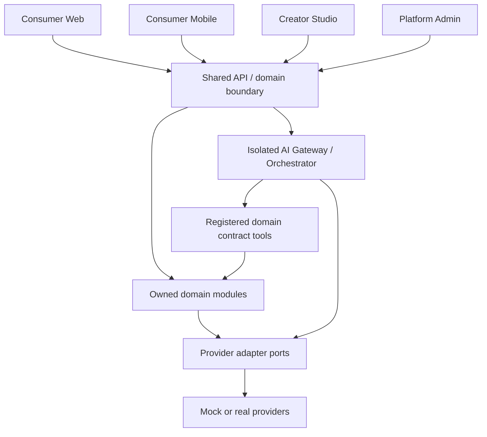

# System overview

## Purpose and scope

Define Velora system boundaries for an adults-only social platform with future creator clubs. Consumer Web and Mobile use one account ecosystem; Creator Studio and Platform Admin are separate clients. This document is authoritative for surface separation, not domain behavior.

## Product surfaces and permissions

- Consumer: own profile, discovery, introductions, chat, availability, safety controls, eligible premium features.
- Creator Studio: creator business profile, club/content tools, club analytics, earnings views. It never grants platform-wide operational authority.
- Platform Admin: audited operations across modules. It requests actions from domain services; it does not directly mutate arbitrary storage.
- Shared API/domain: canonical identity, authorization, lifecycle rules, contracts, audits, and provider abstractions.
- AI Gateway/Orchestrator: optional isolated capability using approved provider adapters and registered domain tools. It never owns or bypasses domain truth.

Surface navigation and UI responsibility are authoritative in `docs/surfaces/`. Approved Figma owns visual/interaction specification only; it cannot change phase, permissions, domain state, or compliance gates.

## Architectural direction

Begin with a NestJS/Fastify modular monolith, separate durable worker role, PostgreSQL/Valkey foundations, and explicit domain contracts under [technical stack authority](09-technical-stack.md). Split services only when load, team boundaries, or isolation evidence demands it. Never make client-to-database or client-to-provider shortcuts.

## Non-goals

No production vendor selection, global content policy approval, real payout connection, or UI design. Club content and mature/explicit capability are not V1 defaults.

## Data and security

Each record has one owning domain; other domains retain IDs or read through contracts. All externally initiated mutation carries actor, authorization context, correlation ID, idempotency key where retryable, and audit trail where sensitive. Private media requires entitlement authorization before signed delivery.

## Dependencies and phase

Depends on domain boundaries, contracts, data ownership, and security baseline. V1 establishes shared API/domain seam, consumer core, Trust & Safety, and Admin foundation. Creator clubs: Phase 2 baseline; AI product capabilities follow [product phases](../product/01-product-phases.md); explicit mature capability: Conditional / Compliance-Gated.

## Open questions

See [open decisions](../decisions/DECISIONS_REQUIRED.md): jurisdiction launch list, identity/age provider, production infrastructure/providers, product policies, and legal/design gates.

## Cross-references

[Repository shape](02-repository-shape.md), [domain boundaries](03-domain-boundaries.md), [AI platform](../ai/01-ai-platform-architecture.md), [surface authority](../DOCS_INDEX.md#product-surface-authority), [Figma authority](../design/03-figma-source-of-truth.md), [phases](../product/01-product-phases.md), [security baseline](../security/01-security-baseline.md).
