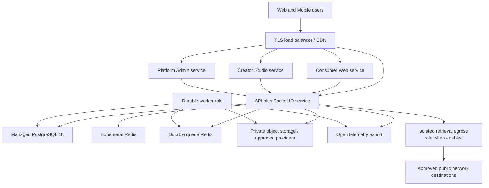

# Technical stack and deployment architecture

## Purpose and authority

This is Velora's concise technical-platform matrix. It answers what is selected, what remains deferred, who owns each boundary, and where replacement may occur. ADR-0003 through ADR-0016 are authoritative for rationale, risks, and migration; ADR-0016 supersedes the active backend-runtime portions identified there. Product phase, domain, security, compliance, operations, and approved Figma authorities remain unchanged.

Every row uses exactly one classification: `LOCK NOW`, `DEFER UNTIL PROVIDER INTEGRATION`, `DEFER UNTIL SCALE REQUIRES`, `DECISION REQUIRED BEFORE FEATURE`, or `REJECTED`.

## Stack matrix

| Area | Decision | Status | Why | Owner | Future replacement boundary |
|---|---|---|---|---|---|
| Repository | One monorepo with required `apps/*` and `packages/*` | LOCK NOW | Atomic contract/client/domain changes with explicit surface boundaries | Platform engineering | Repository split only after independent ownership/release evidence |
| Workspace | pnpm 11 workspaces, one frozen lockfile, `workspace:` dependencies, central catalogue | LOCK NOW | Strict dependency visibility and reproducibility | Platform engineering | Package-manager manifests and CI install contract |
| Task runner | Turborepo 2 | LOCK NOW | Small affected-task/cache layer without owning architecture | Platform engineering | Package scripts and task graph |
| Toolchain provisioning | mise declaring Bun, Node, and pnpm; agreement with `engines`, `.node-version`, and `.bun-version` enforced | LOCK NOW | A plain checkout resolves the exact pinned runtimes instead of failing on a strict engine check | Platform engineering | `mise.toml` and the toolchain preflight |
| Verification CI | GitHub Actions running the canonical `pnpm ci:verify` graph, plus a daily schedule | LOCK NOW | Gates and dependency-acceptance expiry actually execute; deployment vendors stay deferred | Platform operations | One workflow file with read-only permissions |
| Server runtime | Bun 1.3.14 for API, worker, migrations, and compatible backend tests | LOCK NOW | Lean runtime/framework model with proven team experience | Platform engineering | OCI runtime image and application ports |
| Client/tooling runtime | Node.js 24.19.0 for Next.js, Expo, Playwright, generation, and Testcontainers orchestration | LOCK NOW | Required compatibility without making Node the backend production runtime | Platform engineering | Package scripts and client/tool boundaries |
| Language | TypeScript 5.9.3 strict ESM for backend/Web/Mobile/contracts | LOCK NOW | One strongly typed contract/tooling path with current framework compatibility | Platform engineering | Language-neutral API/events and domain ports |
| Consumer Web | Next.js 16 App Router, React 19.2 | LOCK NOW | Public plus authenticated rendering, shared Web toolchain | Consumer Web | REST/OpenAPI client and surface-local UI |
| Creator Studio | Separate Next.js 16 application | LOCK NOW | Web-first creator productivity without consumer coupling | Creator surface / CREATORS | REST/OpenAPI client and Studio-local UI |
| Platform Admin | Separate Next.js 16 application | LOCK NOW | Independent privileged build/deploy/security posture | ADMIN | REST/OpenAPI client and Admin-local UI |
| Consumer Mobile | React Native 0.86 through Expo SDK 57, development builds/prebuild | LOCK NOW | TypeScript contracts plus native push/media/RTC access | Consumer Mobile | REST/OpenAPI client and native module boundary |
| Backend | Elysia 1.4 modular monolith with explicit composition root | LOCK NOW | Small Bun-native HTTP core and explicit module/port conventions | Platform engineering and domain owners | Published application ports, APIs, and outbox events |
| Service topology | One API deployable plus worker role; logical domain modules | LOCK NOW | Transactions and simple operations without unstructured coupling | Platform engineering | Extract measured module behind existing port/event |
| API | REST/JSON over HTTPS, `/v1`, OpenAPI 3.1 | LOCK NOW | Standard language-neutral contracts and generated clients | API/platform and domain owners | Versioned OpenAPI contract |
| Validation/client | Zod 4 schema registry generates OpenAPI and TypeScript client | LOCK NOW | One runtime schema and client generation path | API/platform | Published OpenAPI and compatibility tests |
| Design-token sharing | Client-safe `packages/design-tokens`; no shared component or privilege behavior | LOCK NOW | Preserve approved Master semantics without coupling surface UI | Design/surface engineering | Versioned semantic token contract and approved Figma |
| GraphQL | No default GraphQL API | REJECTED | No current query need justifies auth/query-cost complexity | Platform engineering | New feature ADR only |
| Database | PostgreSQL 18, current supported minor | LOCK NOW | Transactions, constraints, locks, indexes, operational maturity | Domain owners / data platform | Domain repositories, outbox, export/cutover |
| Data access | Drizzle ORM 0.45.x with Bun SQL and explicit SQL escape hatch | LOCK NOW | Strong types without hiding PostgreSQL behavior | Domain owners | Repository interfaces and committed SQL migrations |
| Migrations | Reviewed committed SQL; expand/backfill/contract; dedicated runner; no production push/auto-migrate | LOCK NOW | Safe compatibility and auditable execution | Domain owners / platform | SQL history and migration contract |
| Cache/ephemeral | Logically isolated Redis 8.10 endpoint/credentials; no correctness-only state | LOCK NOW | Shared TTL/rate/presence/fan-out with rebuildable data | Platform / relevant domain | Cache port and rebuildable data |
| Queue Redis | Logically isolated Redis 8.10 with persistence/backup/recovery policy and no unsafe eviction | LOCK NOW | BullMQ coordination and restart durability require a distinct correctness-relevant infrastructure role | Platform operations | Queue connection/restore contract |
| Durable jobs | BullMQ 5.81 with end-to-end effects treated at-least-once | LOCK NOW | Mature Redis-backed retries, delay, coordination, and worker lifecycle | Job-owning domain / platform | Versioned job handlers and owner workflow state |
| Events | PostgreSQL transactional outbox/inbox, versioned facts, at-least-once | LOCK NOW | Atomic owner state plus reliable delivery | Producing/consuming domains | Broker may consume same outbox later |
| External broker | No Kafka/RabbitMQ/NATS initially | DEFER UNTIL SCALE REQUIRES | Avoid operations until throughput/fan-out/extraction requires it | Platform engineering | Outbox dispatcher/consumer contracts |
| Workflow engine | Explicit owner workflow tables plus BullMQ wakeups | LOCK NOW | Approval and high-risk state remains visible and durable | Owning domain / ADMIN | Workflow port and state export/shadow run |
| Realtime | Socket.IO 4.8 WebSocket-only baseline, REST snapshot/resync | LOCK NOW | Rooms/reconnect ergonomics with explicit durable recovery | REALTIME | Realtime client/gateway event contract |
| Realtime fan-out | Ephemeral Redis Pub/Sub adapter; no durable truth | LOCK NOW | Horizontal cross-node fan-out | REALTIME / platform | Socket.IO adapter boundary |
| RTC | WebRTC clients and provider-neutral room/token/lifecycle adapter; recording off | LOCK NOW | Portable media architecture with explicit authorization | REALTIME | RTC provider port and normalized session IDs |
| RTC provider | No managed/self-hosted vendor selected | DEFER UNTIL PROVIDER INTEGRATION | Phase 2 country/quality/privacy/cost requirements unresolved | REALTIME | Provider adapter |
| Object storage | Private object-store port, signed direct upload, quarantined processing, signed delivery/private CDN origin | LOCK NOW | Scalable bytes without making storage entitlement truth | Owning content domain / platform | Object/media/delivery adapter ports |
| Storage/media vendors | Object store, CDN, scanner, transcoder not selected | DEFER UNTIL PROVIDER INTEGRATION | Region, content, cost, and provider gates unresolved | Platform / content owners | Provider adapters and object IDs |
| Image processing | sharp on libvips, in-process behind `MediaImageProcessor` | LOCK NOW | Every assessed hosted processor prohibits content Velora does not author; a resize is not worth a dependency that constrains the roadmap. A library decision under dependency governance, not a provider one — no bytes leave the machine | MEDIA | Processor port; format admission is a platform allow-list applied before the decoder, because libvips renders SVG |
| Authentication | One AUTH registry; opaque Web sessions; short-lived Mobile access plus rotating refresh token | LOCK NOW | Unified identity/revocation with platform-safe transports | AUTH | AUTH provider/session contracts |
| Session/recovery/privileged policy | Exact per-surface lifetimes, cookie policy, refresh rotation/reuse response, recovery limits, Admin MFA/step-up, break-glass semantics per ADR-0017 | LOCK NOW | Security policy stays reviewable in one authority instead of implementation constants | AUTH; ADMIN for privileged operations | Versioned policy values and their conformance tests |
| Authentication provider | Credential/social/OTP provider not selected; local/mock/test first | DEFER UNTIL PROVIDER INTEGRATION | Coverage, assurance, privacy, country, and recovery review needed | AUTH | Provider adapters and canonical subject IDs |
| Authorization | Deny-by-default RBAC plus object/relationship/country/safety policy in owner domain | LOCK NOW | Current domain truth must authorize every action | Each domain; ADMIN owns grants | Versioned policy tests; external engine only after parity |
| Privileged approval | Step-up, exact proposal binding, separation of duties, owner re-authorization | LOCK NOW | Human approval cannot replace deterministic authorization | ADMIN / owning workflow | Approval contract/reference |
| Config | Typed Zod-validated `packages/config`; fail startup on invalid server config | LOCK NOW | Deterministic, reviewable environment behavior | Platform engineering | Config schema and composition root |
| Secrets | Runtime secret-manager/KMS boundary; references only in repository/config | LOCK NOW | Rotation and no secret leakage into artifacts | Security/platform | Secret adapter and versioned references |
| Feature flags | OpenFeature abstraction; ADMIN/PostgreSQL authoritative for critical gates; ephemeral Redis cache only | LOCK NOW | Provider portability without outsourcing compliance truth | ADMIN / domains / ANALYTICS for experiments | OpenFeature provider |
| Notifications | Durable BullMQ attempts backed by PostgreSQL intent/state, versioned templates/preferences, email/push/SMS adapters | LOCK NOW | Source action survives channel failure and vendors stay replaceable | NOTIFICATIONS; AUTH for OTP policy | Channel provider adapter |
| Notification providers | Email, push, SMS/OTP vendors not selected | DEFER UNTIL PROVIDER INTEGRATION | Country, deliverability, privacy, cost, and assurance unresolved | NOTIFICATIONS / AUTH | Channel adapters |
| Billing | BILLING payment intent/state machine, append-only balanced journal, idempotent provider instructions/webhooks/reconciliation | LOCK NOW | Duplicate/ambiguous external money must remain correct | BILLING | Payment adapter and immutable references |
| Entitlements | Product owner grants/revokes from verified commercial facts; never payment/UI state | LOCK NOW | Access is separate from customer money | PRIVATE CLUBS or product owner | Published entitlement contract |
| Payouts | Separate PAYOUTS journal, holds/reserves/claims/disbursement/reconciliation | LOCK NOW | Creator liability and disbursement are not customer charging | PAYOUTS | Payout adapter and immutable references |
| Payment/payout providers | No vendors selected | DEFER UNTIL PROVIDER INTEGRATION | Country/channel/tax/KYC/failure semantics unresolved | BILLING / PAYOUTS | Provider adapters |
| Payment sequence/policy | Capture ordering, refunds, disputes, tax, reserve, payout policy | DECISION REQUIRED BEFORE FEATURE | Provider/product/legal facts needed before live money | Product, BILLING, PAYOUTS, legal/finance | Versioned product/provider state machine |
| AI Gateway/orchestrator | Elysia API admission plus explicit bounded TypeScript state machine | LOCK NOW | Deterministic tools/budgets/approval without vendor agent control | AI PLATFORM | AI platform contracts and run state |
| AI persistence/work | PostgreSQL run/registry/budget metadata and BullMQ AI workers | LOCK NOW | Durable, version-pinned, idempotent async AI | AI PLATFORM | Repository/queue ports |
| AI providers/models | Provider/model/embedding/hosting/routing choices not selected | DEFER UNTIL PROVIDER INTEGRATION | Capability evaluation, privacy, residency, safety, cost required | AI PLATFORM | Provider adapters and evaluation suite |
| AI memory/RAG | Disabled by default; provenance/consent/retrieval ports locked; store/index choice before feature | DECISION REQUIRED BEFORE FEATURE | No AI product capability is V1; durable derived data needs approval | AI PLATFORM plus source owners | Memory/retrieval/index ports and source lifecycle |
| Outbound HTTP | Central controlled egress; isolated retrieval worker; DNS/IP/redirect/network-layer SSRF controls | LOCK NOW | String filters cannot protect private networks or secrets | Security/platform | `OutboundHttp`/retrieval contracts |
| Observability | OpenTelemetry API seams, Pino JSON logs, W3C correlation; Bun SDK/export activation after compatibility proof | LOCK NOW | Portable instrumentation without claiming unsupported runtime integration | Platform / domain owners | OTLP/log export backend |
| Audit | Separate append-only, hash-chained PostgreSQL audit schema; verified batch export to separately administered WORM archive before public privileged production | LOCK NOW | Privileged evidence differs from logs/analytics and needs tamper evidence | ADMIN/security/domain owners | Versioned audit events and archive export contract |
| Audit archive vendor | No WORM/archive provider selected | DEFER UNTIL PROVIDER INTEGRATION | Retention, legal hold, region, access, and cost need provider review | Security/platform operations | Archive export contract and batch verification |
| Telemetry/error backend | No vendor selected | DEFER UNTIL PROVIDER INTEGRATION | Cost, retention, paging, privacy, residency unresolved | Platform operations | OTLP and structured logs |
| Testing | `bun:test` for API/backend; Vitest/Testing Library for Web/packages; `jest-expo`, Playwright, Maestro, and Node Testcontainers orchestration | LOCK NOW | Runtime-appropriate tests plus real PostgreSQL/Redis/BullMQ | Engineering and domain/surface owners | Behavioral contracts and fixtures |
| AI evaluations | Repository-owned versioned evaluation harness and datasets | LOCK NOW | Provider dashboards cannot be sole release evidence | AI PLATFORM / safety/domain owners | Provider adapter and evaluation result schema |
| Deployment artifact | Signed immutable OCI images; same digest promoted | LOCK NOW | Reproducible portable rollback/canary | Platform engineering | OCI registry/platform |
| Infrastructure as code | OpenTofu 1.12.x with encrypted locked remote state | LOCK NOW | Reviewable provider-neutral provisioning | Platform engineering | OpenTofu modules/providers |
| Initial hosting | Single-region managed container platform, managed PostgreSQL, logically separated ephemeral/queue Redis roles, CDN as needed | LOCK NOW | Low early operations with explicit queue durability and horizontal path | Platform operations | OCI/OpenTofu/data backup boundaries |
| Cloud/CI/registry/CDN/DNS | Vendors not selected | DEFER UNTIL PROVIDER INTEGRATION | Must be evaluated against country, network, SLO, cost, and portability | Platform operations/security | OCI, OpenTofu, OTLP, provider adapters |
| Kubernetes/active-active multi-region | Not initial architecture | DEFER UNTIL SCALE REQUIRES | Operational/consistency cost not justified | Platform architecture | Existing containers/contracts/data ownership |
| CI/CD | Frozen install, boundaries, typecheck/tests, real migrations, security, immutable build, staging, canary, approval, rollback | LOCK NOW | Repeatable evidence and safe release | Platform engineering / owners | CI provider-independent pipeline contract |
| Dependency security gate | Real audit plus exact, expiring, owner-signed acceptance records in the dependency risk acceptance register; new high/critical findings fail | LOCK NOW | Unavoidable transitive advisories stay visible and bounded instead of suppressed | Security/platform engineering | Register schema and gate contract |

## Repository dependency map

```text
Client applications
  apps/web
  apps/mobile
  apps/creator-studio
  apps/admin
        |
        | may import only client-safe shared packages
        v
  packages/api-client
  packages/types
  packages/validation
  packages/config (client-safe entrypoint only)
  packages/observability (client-safe entrypoint only)
  packages/design-tokens
        |
        | HTTPS / WebSocket published contracts
        v
  apps/api (composition and transport)
        |
        | owning application service / public domain port
        v
  packages/domain/<owner>
        |
        | owner repository/provider interfaces
        v
  infrastructure adapters injected at composition root
```

Forbidden dependencies:

- A client imports `packages/domain`, a repository, Drizzle schema, Elysia application internals, worker, or provider SDK.
- One domain imports another domain's private repository, table/schema, entity, or provider implementation.
- Provider implementations define or leak business state; ports depend inward and implementations are injected outward.
- Admin, AI, jobs, or migrations bypass owning application services for business mutation.
- Shared `types`, `validation`, or `api-client` gains authorization, persistence, provider, or secret behavior.
- Circular package/domain dependencies. Resolve cycles through a published contract, owner transfer, or versioned event.

## Initial deployment topology



Mobile build/signing and store distribution are separate from runtime topology. Storage, external providers, and isolated retrieval role are provisioned only when their product phase and provider gates permit them.

## Scaling model

### Phase A: initial

Single approved region; three Web deployables; one API/Socket.IO deployable scaled conservatively; one or more worker replicas; managed PostgreSQL; logically separated ephemeral and durable-queue Redis responsibilities; private object storage/CDN as needed; provider adapters; tested backups/restore; no Kubernetes or external broker.

### Phase B: measured horizontal scale

Scale API and worker replicas independently; extract Socket.IO gateway process; add dedicated media, notification, AI, and analytics worker pools; tune PostgreSQL indexes/pooling/read-safe replicas; use CDN and Redis clustering only when metrics require them; add recovery-region posture when approved SLO/RPO/RTO requires it.

### Phase C: selective extraction

Extract realtime gateway, media processing, notification delivery, AI workers, or analytics ingestion only when load, fault isolation, security, or ownership metrics justify it. Use existing ports/outbox events and preserve one writer/source of truth. Microservices and active-active data are never mandatory goals.

## Version and change policy

Versions above are verified baselines on 2026-08-13. Bootstrap pins exact patches and lockfile integrity. Expo SDK 57's package-version heuristic is allowed to ignore only its TypeScript 6 recommendation while ADR-0003 locks TypeScript 5.9.3; strict Mobile typecheck, Expo configuration checks, peer checks, Jest, and iOS/Android exports remain release gates. Supported patch/minor security updates use normal review and the complete affected test suite. Framework/runtime/database major changes require compatibility review and ADR amendment or superseding ADR. No framework, database, broker, provider, cloud, or general agent runtime may be added silently.

## Cross-references

[ADR-0003](../decisions/ADR-0003-monorepo-runtime-language.md), [ADR-0004](../decisions/ADR-0004-client-frameworks.md), [ADR-0005](../decisions/ADR-0005-backend-api-architecture.md), [ADR-0006](../decisions/ADR-0006-database-data-access-migrations.md), [ADR-0007](../decisions/ADR-0007-cache-jobs-events.md), [ADR-0008](../decisions/ADR-0008-realtime-rtc.md), [ADR-0009](../decisions/ADR-0009-auth-authorization.md), [ADR-0010](../decisions/ADR-0010-media-storage-delivery.md), [ADR-0011](../decisions/ADR-0011-payments-payouts.md), [ADR-0012](../decisions/ADR-0012-ai-platform-runtime.md), [ADR-0013](../decisions/ADR-0013-observability-testing.md), [ADR-0014](../decisions/ADR-0014-deployment-environments-cicd.md), [ADR-0015](../decisions/ADR-0015-shared-design-token-boundary.md), [ADR-0016](../decisions/ADR-0016-bun-elysia-redis-bullmq-backend.md), [ADR-0017](../decisions/ADR-0017-auth-session-recovery-security-policy.md), [dependency risk acceptance](../security/08-dependency-risk-acceptance.md), [domain boundaries](03-domain-boundaries.md), and [product phases](../product/01-product-phases.md).
