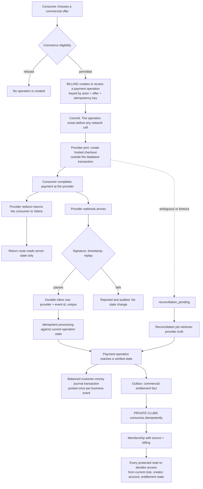
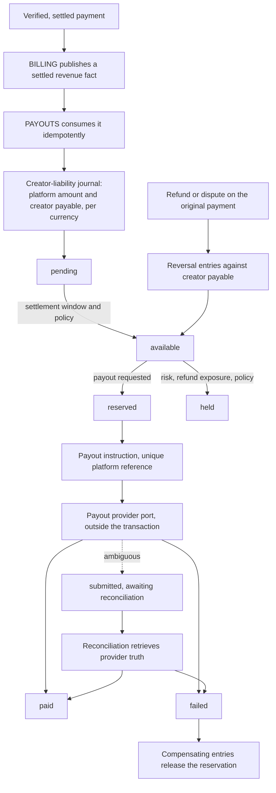

# Money flow

## Purpose and authority

One map of where money facts come from, what may derive from them, and which boundary each crossing goes through. [ADR-0011](../decisions/ADR-0011-payments-payouts.md) owns the ownership split and [ADR-0021](../decisions/ADR-0021-monetization-money-architecture.md) owns the implementation shape; this document is the picture those two describe, and it is authoritative for nothing on its own. Where it appears to disagree with a domain, flow, security, or compliance authority, that authority wins and this map is wrong.

It exists because the failure mode in a payment system is not usually a bug in one step. It is a step deriving authority from a neighbour that never had it — a redirect treated as settlement, a provider status treated as entitlement, a cached balance treated as money. Drawing the whole path once makes those crossings visible.

## The three authorities

Nothing in the diagrams below crosses these lines.

| Authority | Owns | Is never derived from |
|---|---|---|
| Provider | Card data, bank details, identity documents, tokenization, external settlement, its own compliance state | Anything Velora stores |
| BILLING | Offers, immutable price snapshots, payment operations, subscriptions, verified provider events, refunds, disputes, the customer-money journal | A client claim, a redirect, or an unverified webhook |
| PRIVATE CLUBS | Club membership and entitlement, and the decision to admit somebody to content | A payment state read directly out of BILLING tables |
| PAYOUTS | Creator payable balances, holds and reserves, payout instructions, the creator-liability journal | A mutable balance column, or any BILLING row read directly |

A provider identifier is a reference. It correlates a Velora record with an external one and confers no business meaning by itself.

## Consumer purchase to club access

Five properties of that picture are load-bearing.

**The operation exists before the provider call.** A process that dies between the commit and the provider response leaves a durable record that reconciliation can resolve. The reverse order leaves a charge nobody in Velora knows about.

**The redirect is not on the money path.** It reaches `H`, which reads server state and renders it. There is no arrow from `G` to `M`. A consumer who fabricates the return URL gets a page describing what the server already believed.

**The journal is posted from the verified state, not from the webhook.** One business event posts one balanced transaction, enforced by a unique constraint on the business reference rather than by the handler being careful.

**Entitlement is published, never written.** BILLING emits a fact through the outbox and PRIVATE CLUBS applies its own policy. This is the seam that already exists in `apps/api/src/clubs/billing.ts`, and it is why a commercial reversal revokes access through the same door it was granted through.

**Access is re-decided on every read.** A membership row is an input to the decision, not the decision.

## Payment to creator payout

The reservation at `G` is what stops two concurrent payout requests spending the same balance, and it is an accounting transaction rather than a lock: the balance is derived from journal entries, so a reservation that exists is visible to every replica that reads it. A payout never exceeds the derived available amount, and no code path decrements a stored number.

`E -> F` is deliberately drawn as policy rather than as elapsed time. Settlement windows, refund exposure, reserves, and negative-balance treatment are all unresolved commercial decisions, and inventing a constant here would be inventing policy.

## Reversal and failure paths

Each of these is a first-class path with its own state, not an edit to a happy-path record.

| Event | Financial consequence | Entitlement consequence | Where authority sits |
|---|---|---|---|
| Payment failure or decline | Operation reaches `failed`. No journal posting beyond what already occurred | None was granted | Verified provider state |
| Ambiguous provider outcome | Operation stays pending. Nothing is posted, nothing is granted | None | Reconciliation against provider retrieve |
| Refund | Compensating entries. The original transaction is never edited or deleted | Published as a reversal fact; PRIVATE CLUBS applies published customer terms | Approved refund policy, which does not exist yet |
| Dispute or chargeback | Explicit dispute record, its own entries, its own lifecycle. Not modelled as a refund | Published as a distinct fact; treatment during an open dispute is an unresolved decision | Verified provider dispute events |
| Subscription cancellation | No money moves. Period end is recorded | Published; access through period end is a policy question | Approved cancellation terms, unresolved |
| Payout failure | Reservation released through compensating entries | None | Verified provider payout state |
| Provider account restriction | New commercial operations refuse. Existing records are preserved unchanged | Existing entitlement is unaffected by a provider's opinion | [Market entry gates](../compliance/01-market-entry-gates.md) |

The common rule across the table: history is appended to, never rewritten. A correction is a new balanced transaction that references what it corrects, so the books can be replayed and the reason for every movement survives.

## What the map forbids

- A client asserting that a payment succeeded, a refund completed, a subscription is active, or a payout was made.
- A success redirect, a query parameter, or an unverified webhook advancing any state.
- Entitlement granted because a checkout was created or a payment method was stored.
- A single mutable balance column standing as authoritative truth for a creator's money.
- Floating-point arithmetic anywhere on the money path, or an amount separated from its currency.
- A provider or tax network call inside an open PostgreSQL transaction.
- Any domain writing another domain's tables to reflect a financial outcome.
- Summing two currencies into one displayed total.

## Cross-references

[Payment lifecycle](../flows/payment-lifecycle.md), [creator entitlement](../flows/creator-entitlement.md), [BILLING](../domains/billing.md), [PAYOUTS](../domains/payouts.md), [PRIVATE CLUBS](../domains/private-clubs.md), [domain boundaries](03-domain-boundaries.md), [contracts and events](04-contracts-events.md), [data ownership](05-data-ownership.md), [provider adapters](06-provider-adapters.md), [payment and webhook security](../security/05-payments-webhooks.md), [payments, tax, and payout gates](../compliance/04-payments-tax-payout-gates.md), [provider eligibility](../compliance/06-payment-provider-eligibility.md), [jobs, idempotency and concurrency](../engineering/03-jobs-idempotency-concurrency.md), [ADR-0011](../decisions/ADR-0011-payments-payouts.md), [ADR-0021](../decisions/ADR-0021-monetization-money-architecture.md).
