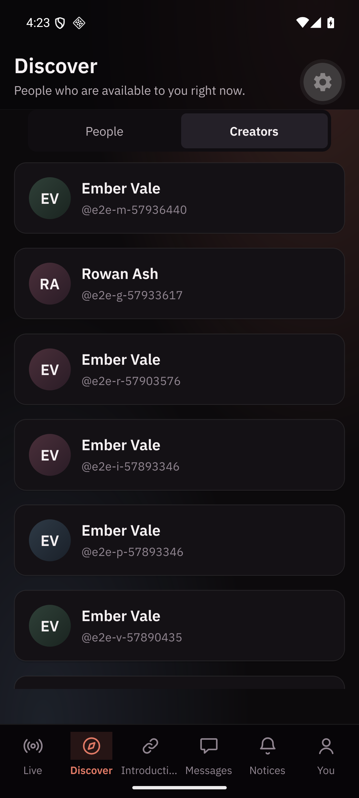
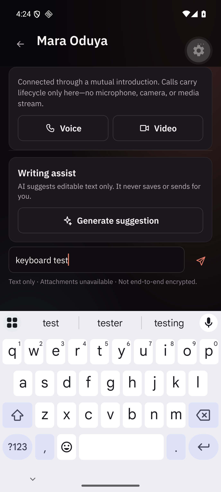
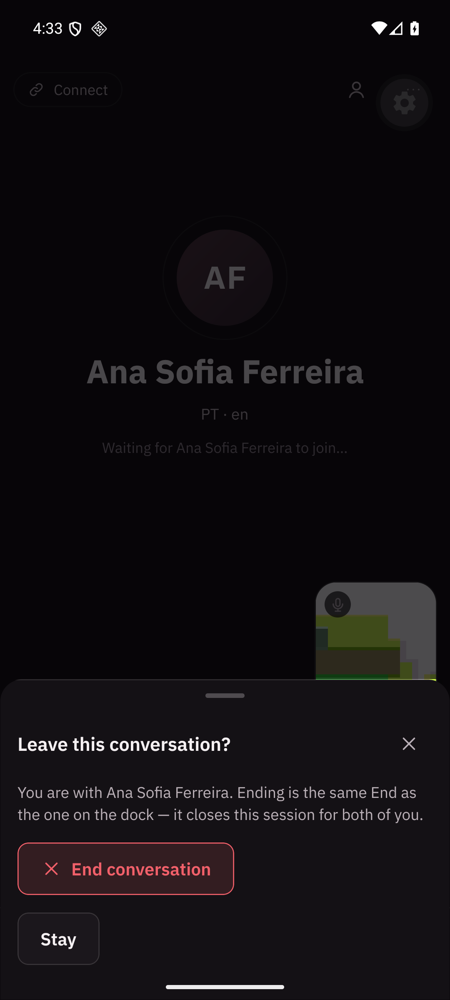
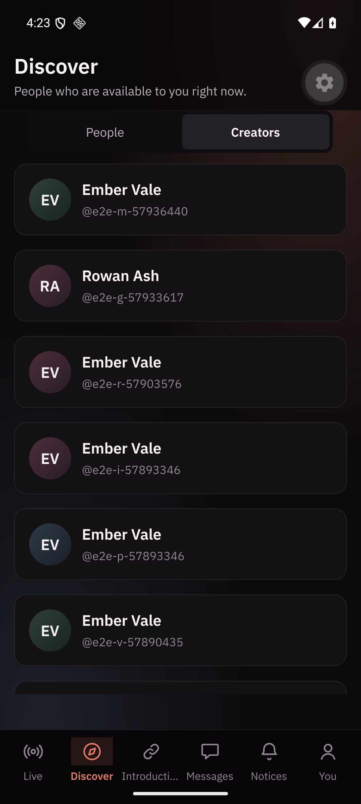

# Consumer completion: what was observed, on a device and in browsers

Recorded 2026-09-02, for [ADR-0045](../../decisions/ADR-0045-consumer-completion-doorways-keyboards-and-a-camera-that-is-off.md).
Every claim here is something that was watched happen. Where a thing is argued
rather than observed, it says so.

The product was walked as a person rather than audited as a surface: signed
out, in, through Live, into a conversation, out to a creator, into the wallet
and back — deliberately trying to get lost.

## Consumer Web, in a real browser

Driven by Playwright against the built surfaces and the real API, at the widths
in `e2e/viewport.ts` and at twice the text size.

- **Back walks history rather than growing it.** Discover, a person, Back:
  the browser's own Back afterwards does not re-enter the person, which is what
  it did when the control pushed. Asserted in
  `e2e/consumer-navigation.spec.ts`.
- **A dialog is dismissed by Back rather than the page.** With the sign-out
  confirmation open, Back closes the dialog, leaves the address alone, and
  spends no ghost press afterwards.
- **A person's decision row overflowed at twice the text on a 320 px phone.**
  Found by adding `/people/<id>` to the width matrix — a route the matrix had
  never visited. Pass, Interested and the safety control could neither wrap nor
  shrink, so the row pushed the whole document sideways.
- **Every `overflow-y: auto` pane was also a sideways scroller.** The
  containment measure excused anything inside one, which is why three of the
  defects in this phase were invisible to it. Panes now clip explicitly, and
  the measure reports any container that scrolls sideways inside itself —
  which immediately found Platform Admin's decision tables doing it on purpose,
  now allowed by name beside the consumer section switch.

## Live over a real provider

Self-hosted LiveKit 1.13.6 on loopback, two seeded accounts in two browser
contexts, Consumer Web on port 3100 because the machine already had somebody
else's server on 3000. Recorded in full in
[`../live-provider`](../live-provider/README.md).

- Both people saw and heard each other: decoded frames on both sides, inbound
  video **and** audio byte counts above zero on both sides.
- **A camera turned off removed the picture entirely** rather than leaving the
  last frame frozen, and the caption named whose camera it was — while the
  failure and reconnecting states were asserted absent at the same moment.
- **The voice kept arriving** while the camera was off, measured on the
  transport rather than on a caption, and the chat crossed the same session.
- The camera came back and the picture decoded again, with an advancing clock.
- **Exactly one `RTCPeerConnection` existed throughout**, counted from a proxy
  installed before any page script ran. There is no second session, and no
  separate voice stack.

## Consumer Mobile, on an Android 36 emulator

A debug build of this branch, installed on a running `velora-android36`
emulator, signed in against the local API through `adb reverse`, driven with
`adb` and read from screenshots. The four that decide something are beside this
document.

- **Creators are reachable.** Discover's two halves are on the phone, the
  public directory lists creators, and a creator's page opens on their name and
  bio rather than the word "Creator". Before this, both screens existed and
  nothing in the product linked to either.
  
- **The composer sits above the keyboard.** With the keys up, the field being
  typed into, the Send control and the "Not end-to-end encrypted" line are all
  on screen. This is the Android 15 window that is no longer resized for the
  IME; before the frame measured it, all three were behind the keys.
  
- **Hardware Back answers in order.** With the keyboard up it dismissed the
  keyboard and left the screen alone; pressed again it left the conversation
  for the Inbox. In an encounter it asked, naming the person, with the same End
  the dock offers — and Back again closed that sheet without ending anything.
  Ending through the sheet returned to the door.
  
- **Back keeps the section it left from.** Returning from a creator's page
  landed on Discover with the Creators half still selected, because the section
  lives in the address.
  
- **A running search is stopped by Back** rather than backgrounding the
  application with the search still running.
- An encounter on this device connected to a real LiveKit Cloud room, confirmed
  from `logcat`. The peer was a stand-in that never publishes, so this is
  evidence about the session and the controls rather than about media; the
  media proof is the browser-to-browser run above.

## What was not observed

- Camera-off **rendered on an Android screen** with a real remote peer. The
  rules are proved at the hook level on both platforms against a room double
  that fires the provider's own mute events, at the stage level on Android for
  the sentence a person reads, and end-to-end in a browser against a real
  provider. A phone showing a real peer's camera going off needs two real
  participants meeting each other, which this machine could not hold steady
  while also running the emulator.
- Anything about picture quality, real microphone routing, Bluetooth headsets
  or physical handsets. The emulator's camera is a synthetic scene and its
  microphone is silence.
