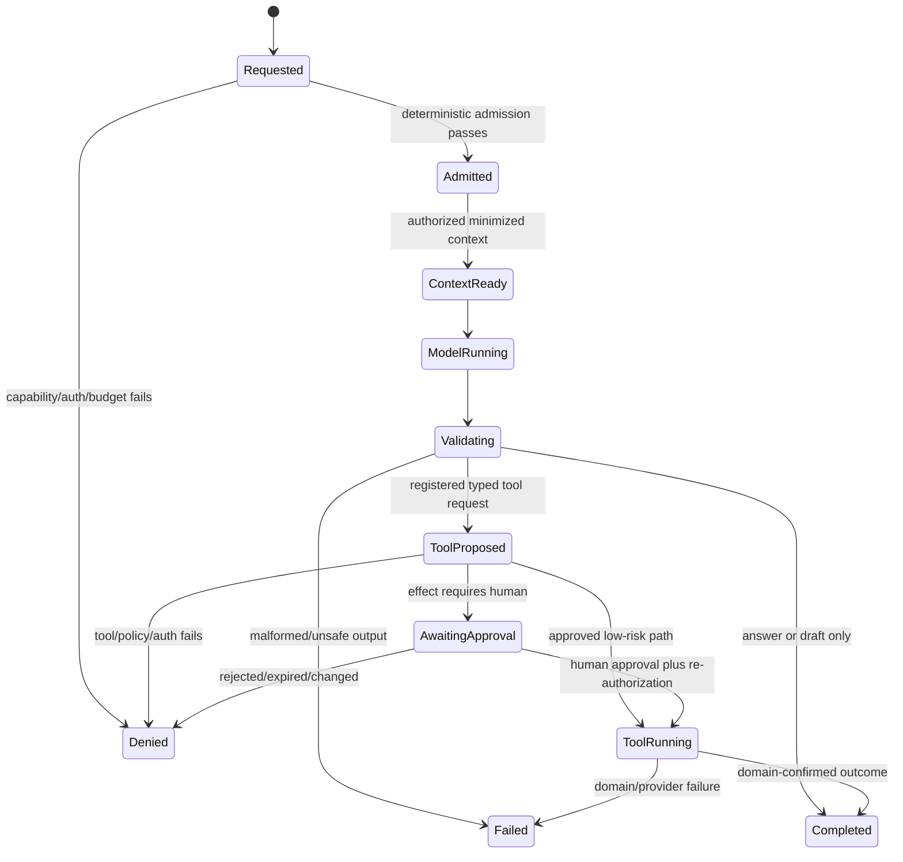

# AI-assisted action and human approval flow

## Purpose and authority

Define common flow from AI request through recommendation, tool use, approval, and authoritative domain execution. This flow applies to consumer, creator, moderation, and Admin AI. It does not grant any product capability or domain permission.

## Actors and preconditions

Actors are authenticated User, Creator, Moderator, Support/Finance/Admin, Platform Admin, or Owner/Super Admin; AI Gateway/Orchestrator; human approver where required; and owning domain service. Capability must be enabled for actor, client, country, phase, safety class, provider route, and budget. Tool and prompt/schema versions must be active and evaluated.

## Main flow

1. Gateway authenticates actor, validates capability/version/request, applies quota and rate admission, and creates run ID.
2. Context Builder retrieves only authorized, purpose-bound data and labels user, memory, RAG, and tool content as data.
3. Router chooses an approved provider/model route under data, safety, latency, and cost policy.
4. Model returns free text or structured output. Orchestrator validates schema, safety, size, provenance, and capability constraints.
5. Answer/draft-only output is clearly labeled and returned without domain mutation.
6. If model proposes a tool, Orchestrator verifies registry allowlist, arguments, actor/object scope, current authorization, effect class, budget, and idempotency requirements.
7. For approval-required effects, store immutable proposal and pause. Human reviewer sees source context, model output, confidence/limitations, target, exact arguments, expected effect, and policy reason; reviewer approves/rejects under existing RBAC/step-up/dual-control rules. ADMIN or the owning governed workflow stores the authoritative approval; AI stores only its reference and run projection.
8. At execution, owning domain re-authenticates/re-authorizes, checks approval binding/current state, validates business rules, applies idempotent transition, and writes authoritative audit/event. AI reports only confirmed domain outcome.

## Sensitive-operation boundary

Payment, refund, payout, enforcement, ban, account/security, entitlement, account deletion, privileged role/configuration, sensitive content publication, and comparable high-impact operations cannot follow a model-only or automatic approval path. AI may summarize, recommend, or draft a request. Authorized human approval and deterministic domain policy are mandatory; existing domain workflows may require step-up, separate approver, threshold, or multiple approvals. AI is never approver or authorization source.

## Alternate and failure flows

Prompt injection or disallowed tool request is denied and recorded as a security signal. Malformed structured output is rejected; bounded retry may use same approved capability policy. Provider outage may use only approved equivalent fallback; otherwise run fails safely. Authorization or consent revoked while waiting causes recheck failure. Any proposal argument, target, effect, prompt/capability version, or material source change invalidates prior approval. Duplicate execution returns same idempotent outcome. Ambiguous domain/provider outcome remains pending and reconciles by owning domain; AI must not claim success.

Async runs pin versions and checkpoint state, but re-authorize before every sensitive read/effect and after approval wait. Cancel stops future model/tool work where possible; already committed domain state follows domain compensation/reversal workflow, never AI rollback invention.

The [implemented local/test slice](../decisions/ADR-0033-local-test-ai-suggestion-platform.md) stops at step 5. A client-created run identity permits in-flight cancellation; reuse is an explicit conflict and cannot consume a second durable usage reservation. The gateway has no registered tools, approvals, or effect state, so a generated draft can reach business truth only if the actor later uses the surface's ordinary, separately authorized Save, Send, or Publish control.

## Permissions, data, and observability

Actor receives no more data or tool scope through AI than through direct product use. Model/provider receives no service credential. Proposal, approval, execution, and outcome use one correlation chain. Trace run/capability/prompt/model route/tool schema/approval/outcome with redaction; do not copy raw sensitive context into generic logs or analytics.

## Phase and cross-references

Capability phase comes only from [product phases](../product/01-product-phases.md). Moderation AI assistance is Phase 2; consumer, creator, and Admin AI assistance are Phase 3; broader autonomous agents are Future / Moonshot. See [AI platform](../ai/01-ai-platform-architecture.md), [AI capabilities/tools](../ai/02-ai-capabilities-tools.md), [AI safety](../ai/04-ai-safety-security.md), [RBAC](../security/02-access-control-rbac.md), [Admin operations](admin-operations.md), and [jobs](../engineering/03-jobs-idempotency-concurrency.md).
