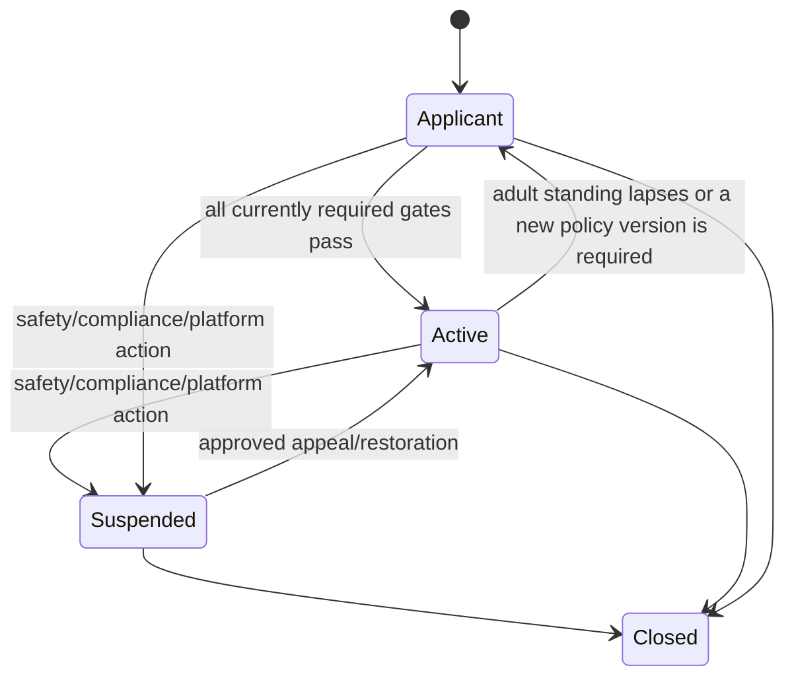

# Creator lifecycle, club, and content flow

## Purpose and authority

Define creator application through activation, club/content operation, suspension, and appeal. CREATORS owns creator lifecycle/business profile/eligibility; IDENTITY ASSURANCE owns creator-identity evidence; PRIVATE CLUBS owns club/content/entitlement state; MODERATION owns review case; TRUST & SAFETY owns enforcement; BILLING/PAYOUTS own money state.

## Creator lifecycle

[ADR-0020](../decisions/ADR-0020-creator-capability-activation.md) locks this ladder and records why it is shorter than a review-and-verify workflow: `under_review`, `verified`, and `declined` are states of the creator identity-verification predicate, which has no approved provider and whose criteria are `DECISION REQUIRED`. Modelling them as lifecycle states would put values in the schema that no code could move a row out of.

User explicitly requests creator capability; CREATORS records an idempotent application and applies current country/channel/creator policy. Activation requires a consumer account in good standing, adult assurance at least `self_declared` from the standing contract USERS publishes, and acknowledgement of every currently required creator policy document at its current version. Admission is derived from stored evidence on every read and reconciled in both directions, so a creator never stays active on evidence they no longer hold. Suspension and closure are set by decisions that reconciliation does not own and are never lifted by it.

Verification result is one predicate, separate from the lifecycle. In Phase 2, CREATORS reads creator-identity evidence from IDENTITY ASSURANCE and re-evaluates it with current policy. It gates mature/explicit content and payout readiness — both deferred — and never the ability to hold the capability. Full activation additionally requires product phase, country, content category, safety, provider, legal/privacy, and operations approval.

Creator profile changes are versioned and publish only approved public fields. Creator role never grants Admin or ordinary consumer-discovery advantage.

## Club, offer, and content lifecycle

1. Active eligible creator creates a club draft and approved offers/pricing under PRIVATE CLUBS/BILLING contracts.
2. Pricing change creates a new version with effective date and customer/renewal treatment; it does not rewrite historical purchase snapshots.
3. Creator requests purpose-bound upload; media stays quarantined during validation, scanning, processing, and required moderation.
4. Content moves `draft -> processing -> submitted/review -> approved/published` or `rejected/restricted/removed` with policy/version/audit.
5. Public page shows only published safe/free preview. Private delivery follows current entitlement, creator/content, country/channel, and safety checks.
6. Subscription/PPV and entitlement follow [creator entitlement](creator-entitlement.md) and [payment lifecycle](payment-lifecycle.md).
7. Analytics/earnings/payout views use ANALYTICS/PAYOUTS truth in their approved phases.

## Suspension, takedown, and appeal

Creator suspension/revocation can stop new publication, sales, payout, or delivery according to scoped policy while preserving lawful customer, financial, evidence, and appeal obligations. Content takedown is separate from creator-wide enforcement. Owning domain rechecks current state and publishes minimized effects.

Appeal records challenged decision, permitted evidence, policy version, reviewer/approval, and result without deleting prior history. AI or provider signal cannot be sole authorization for creator suspension, content removal, or appeal closure where human review is required.

## Failure, concurrency, and privacy

Duplicate application, callback, upload completion, publish, offer, or financial event is idempotent. Competing review/publish/price/suspension actions use state version and precedence. Provider ambiguity stays pending. Failed processing or moderation never publishes content.

Raw identity/consent evidence, payment data, private media, subscriber private behavior, and moderator rationale are restricted and excluded from generic analytics/logs. Team/delegated creator access is not assumed.

## Phase and open decisions

Phase 2 covers web-first creator identity, club, subscription, locked content, and PPV pilot after gates. Analytics/earnings/payouts and creator AI are Phase 3. Mature/explicit content remains Conditional / Compliance-Gated.

`DECISION REQUIRED / LEGAL REVIEW REQUIRED`: creator criteria, reapplication/appeal, team roles, content taxonomy, pre/post moderation, offer/price changes, subscription/grace/cancellation, suspension impact, participant evidence, and payout readiness.

See [Creator Studio](../surfaces/03-creator-studio.md), [creator product](../product/03-creator-private-clubs.md), [IDENTITY ASSURANCE](../domains/identity-assurance.md), [identity verification](identity-assurance-verification.md), [creator gates](../compliance/03-creator-content-gates.md), and [moderation operations](../operations/02-moderation-operations.md).
