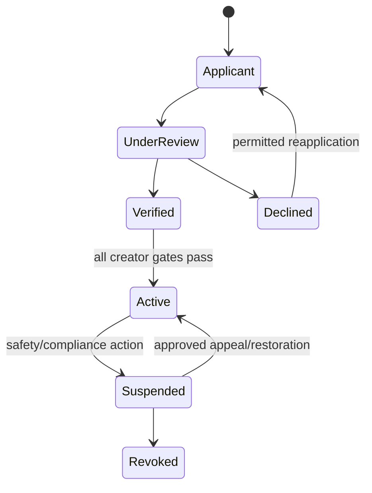

# Creator lifecycle, club, and content flow

## Purpose and authority

Define creator application through activation, club/content operation, suspension, and appeal. CREATORS owns creator identity/eligibility; PRIVATE CLUBS owns club/content/entitlement state; MODERATION owns review case; TRUST & SAFETY owns enforcement; BILLING/PAYOUTS own money state.

## Creator lifecycle

User requests creator capability; CREATORS records idempotent application, collects minimum business/verification references, and applies current country/channel/creator policy. Verification result is one predicate. Activation additionally requires product phase, age/identity, country, content category, safety, provider, and operations gates.

Creator profile changes are versioned and publish only approved public fields. Creator role never grants Admin or ordinary consumer-discovery advantage.

## Club, offer, and content lifecycle

1. Active eligible creator creates a club draft and approved offers/pricing under PRIVATE CLUBS/BILLING contracts.
2. Pricing change creates a new version with effective date and customer/renewal treatment; it does not rewrite historical purchase snapshots.
3. Creator requests purpose-bound upload; media stays quarantined during validation, scanning, processing, and required moderation.
4. Content moves `draft -> processing -> submitted/review -> approved/published` or `rejected/restricted/removed` with policy/version/audit.
5. Public page shows only published safe/free preview. Private delivery follows current entitlement, creator/content, country/channel, and safety checks.
6. Subscription/PPV and entitlement follow [creator entitlement](creator-entitlement.md) and [payment lifecycle](payment-lifecycle.md).
7. Analytics/earnings/payout views use ANALYTICS/PAYOUTS truth in their approved phases.

## Suspension, takedown, and appeal

Creator suspension/revocation can stop new publication, sales, payout, or delivery according to scoped policy while preserving lawful customer, financial, evidence, and appeal obligations. Content takedown is separate from creator-wide enforcement. Owning domain rechecks current state and publishes minimized effects.

Appeal records challenged decision, permitted evidence, policy version, reviewer/approval, and result without deleting prior history. AI or provider signal cannot be sole authorization for creator suspension, content removal, or appeal closure where human review is required.

## Failure, concurrency, and privacy

Duplicate application, callback, upload completion, publish, offer, or financial event is idempotent. Competing review/publish/price/suspension actions use state version and precedence. Provider ambiguity stays pending. Failed processing or moderation never publishes content.

Raw identity/consent evidence, payment data, private media, subscriber private behavior, and moderator rationale are restricted and excluded from generic analytics/logs. Team/delegated creator access is not assumed.

## Phase and open decisions

Phase 2 covers web-first creator identity, club, subscription, locked content, and PPV pilot after gates. Analytics/earnings/payouts and creator AI are Phase 3. Mature/explicit content remains Conditional / Compliance-Gated.

`DECISION REQUIRED / LEGAL REVIEW REQUIRED`: creator criteria, reapplication/appeal, team roles, content taxonomy, pre/post moderation, offer/price changes, subscription/grace/cancellation, suspension impact, participant evidence, and payout readiness.

See [Creator Studio](../surfaces/03-creator-studio.md), [creator product](../product/03-creator-private-clubs.md), [creator gates](../compliance/03-creator-content-gates.md), and [moderation operations](../operations/02-moderation-operations.md).
