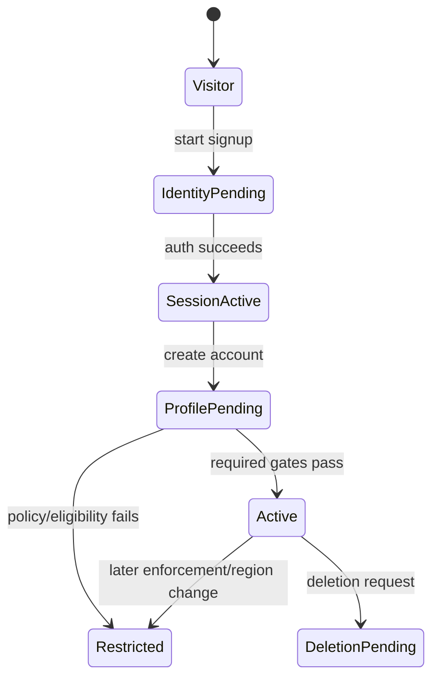

# Adult account onboarding flow

## Purpose and authority

Define V1 consumer onboarding lifecycle. AUTH owns identity/session; USERS owns account/profile. This flow does not select final age/identity provider or jurisdiction rules.

## Preconditions

Visitor is in permitted channel/country, accepts required terms/privacy notices, and supplies allowed authentication input. Age/adult gate and any age-verification requirement are evaluated according to configured jurisdiction policy; do not treat a declared age as universal verification.

## Main and alternate flows

1. AUTH validates signup/sign-in, rate limits, and creates/links identity idempotently.
2. AUTH establishes protected session; USERS creates account/profile draft.
3. User completes required profile and adult/region eligibility gates.
4. USERS activates account only when all necessary predicates are true, then emits lifecycle event.

Duplicate submission returns prior result. Expired/invalid token, rate limit, denied eligibility, failed provider check, or incomplete profile returns safe next step without exposing sensitive policy signals. Authentication success alone does not allow discovery/messaging if profile/safety state is not active.

## Permissions, data, security

Anonymous can start only own flow; authenticated subject edits only own draft. Passwords/tokens never appear in logs. Restrict enumeration, abuse, redirects, sessions, verification evidence and document access. Record consent/policy version and security audit where required. Lifecycle events are minimized and dedupable.

## Concurrency and phase

Identity unique key plus command idempotency avoids duplicate accounts; profile activation uses authoritative eligibility recheck. V1. `DECISION REQUIRED / LEGAL REVIEW REQUIRED`: exact adult proof, minimum profile, countries, re-verification triggers. See [AUTH](../domains/auth.md), [USERS](../domains/users.md), [consumer account/profile](consumer-account-profile.md), [adult verification](../compliance/02-adult-age-verification.md), [privacy](../security/03-privacy-retention.md).
