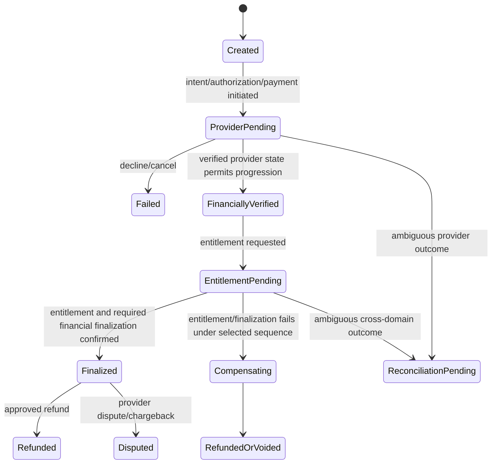

# Payment lifecycle

## Authority

Define financial safety coordination for consumer/creator commercial products. BILLING owns financial transitions; receiving domain owns entitlement. Exact provider/product sequence is selected by approved ADR and may be authorize/reserve before entitlement then capture/finalize, or verified payment before entitlement with explicit compensation/refund. It must prevent unearned charge, unpaid delivery, duplicate money movement, and fabricated success.

## Preconditions

Offer is active, product/country/channel/customer eligibility passes, immutable price snapshot is accepted, operation carries idempotency key, and authenticated actor is authorized. No flow is valid if it promises access to another person.

## Main, alternate, and failure flows

Create/reuse operation by idempotency key and immutable offer snapshot. Use provider adapter for selected payment sequence. Request idempotent entitlement only when verified financial state and policy permit; persist correlation. Finalize/capture, entitlement grant, and any void/refund compensation follow one documented state machine per product/provider. Provider webhook is verified, deduped, and reconciled with local operation. Timeout/duplicate/retry leaves state pending or returns same result; bounded durable reconciliation resolves from verified provider and entitlement-owner state. Failed safe provider calls retry with backoff; exhausted or inconsistent attempts enter operational review/DLQ without inventing state. Refund/dispute/chargeback produces auditable financial fact and triggers entitlement policy evaluation, never direct table edits. Reconciliation compares local amount/currency/status/reference with provider truth, records mismatch, and repairs only through approved owner workflow.

## Security/concurrency/permissions

Use unique operation/provider reference, state version/transaction, outbox, and replay protection. No raw card/secret in client/log/event. Customer sees own receipts/status. Finance actions are role/scope/limit/approval/audit controlled. Provider is not trusted until signature/timestamp/replay checks pass.

## Phase/open questions

Phase 2 first commercial releases; Phase 3 coins/gifts/payout impact. `DECISION REQUIRED / LEGAL REVIEW REQUIRED`: capture ordering per provider/product, refunds, dispute/chargeback handling, tax, ledger model. See [BILLING](../domains/billing.md), [payment security](../security/05-payments-webhooks.md), [payment/payout gates](../compliance/04-payments-tax-payout-gates.md), [finance operations](../operations/03-finance-payout-operations.md), [jobs](../engineering/03-jobs-idempotency-concurrency.md).
