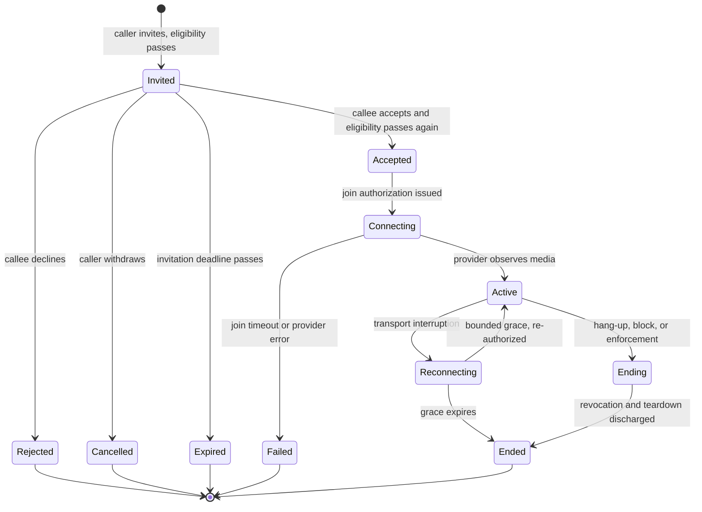

# Realtime voice and video lifecycle

## Purpose

Define how a one-to-one consumer call is invited, authorized, established, recovered, and ended, and which domain decides each step. [REALTIME](../domains/realtime.md) owns the session; [ADR-0025](../decisions/ADR-0025-rtc-live-communications-architecture.md) is the architecture authority. No RTC provider is selected and live calling is blocked.

## Preconditions

The caller holds an authenticated Consumer session on the Consumer audience and an account in a standing that permits interaction. DISCOVERY reports a current mutual introduction between caller and target. TRUST & SAFETY reports no pairwise block and no live enforcement denying consumer interaction to either party. The composed eligibility contract is available in this environment; by default it is not, and every pair is refused.

Presence is not consent to contact, and an accepted introduction is not standing permission to call. Both are re-derived at every step below.

## Main flow

**Invite.** The caller names a target through the relationship, never through a participant field. REALTIME composes eligibility inside the writing transaction under the pair lock, writes the session, its two participants, and its outbox fact together, and commits. The invitation is durable before anybody is told about it, so a notification that never arrives loses a ring rather than a call.

**Ring.** NOTIFICATIONS delivers from the committed fact. Delivery is at-least-once and may reach several devices. Duplicate rings never become duplicate acceptances, because acceptance is one guarded transition on the session and later devices observe the accepted session rather than accepting again.

**Accept or refuse.** The recipient accepts, rejects, or lets the invitation expire; the caller may cancel until one of those happens. Acceptance re-composes eligibility. A block that commits between the invitation and the acceptance means the acceptance is refused and the invitation is invalidated.

**Authorize.** Each participant requests join authorization for itself. Issuance re-composes eligibility, checks the session is accepted and not terminal, and returns a single-participant, single-session, capability-scoped, minutes-scale credential carrying the session's current authorization generation. Nothing reusable is stored.

**Connect.** Endpoints join through the provider. The platform learns that media exists from verified provider events, and treats that as an observation of technical state rather than as a grant of anything.

**End.** Either participant hangs up; a block or enforcement ends the call without either of them acting. Ending advances the authorization generation, records revocation and teardown obligations, and commits. A worker discharges them against the provider outside any transaction; reconciliation verifies the outcome and repairs drift.

## Alternate and failure paths

**Invitation expiry** produces a missed-call fact exactly once, derived from the session's own lifecycle rather than from any delivery outcome.

**Reconnect** is bounded. A transport interruption does not mean a call ended, and a reconnect obtains fresh authorization rather than reusing a credential: eligibility is re-composed, the generation is re-checked, and a session that was ended, revoked, or blocked in the meantime refuses. An interruption is therefore when a block takes effect rather than a window that outlives one.

An interruption changes nothing else about the call. It keeps its participants, its provider room, and its authorization generation — advancing the generation would kill the credential the other side is still holding — and the instant media first flowed stays the instant media first flowed rather than being rewritten by each leg.

**Both waits are bounded by a stored deadline, not by a timer.** The session records when its current state began, separately from when the row was last written, and two sweeps read it: a call that never established media is `failed` with a join timeout, and an interruption that outlives its grace is `ended`. The distinction is deliberate — a call that never connected is a failure to connect, not something that looks like somebody hung up, and a call nobody is connected to cannot be told apart from a call everybody has left. Because the deadline is already true in the database, a missed sweep delays a record and changes no decision, and because every closure is a guarded transition, two sweeps racing produce one ending.

**Provider outage** fails closed and visibly. Sessions that cannot be created are `failed` with a normalized reason, not silently retried into existence, and no path infers success from a timeout.

**Ambiguous provider creation** is recovered by idempotent lookup against the provider-operation identity committed before the call, then by reconciliation. Crashes between any two boundaries are recoverable in the same way.

**Divergence** — a provider room alive after the platform ended a call, a participant still connected after revocation, a session pending creation too long, a callback never delivered — is detected by bounded reconciliation, which records a finding before it repairs and may only move toward termination. It never resurrects an ended call and never overrides safety.

## Security, concurrency, and data

Every mutating route re-resolves the acting principal against the session's participant rows; a non-participant is answered exactly as a session that does not exist. No request field names a participant, session, provider, room, scope, duration, or state. Mutating calls are idempotent. Concurrency is decided by the session's own guarded transitions and the pair lock, so accept-versus-cancel, accept-versus-block, end-versus-reconnect, and duplicate invitations resolve to one outcome under any interleaving.

Durable state is lifecycle only: who invited whom, under which relationship, at which times, in which state, against which provider reference, and why it ended. No media, recording, transcript, SDP, ICE candidate, TURN credential, reusable join credential, or participant IP address is stored anywhere, so a report about a call carries the session, its participants, and its timestamps and nothing else.

Realtime fanout carries hints. Clients recover authoritative state by reading it, and a fanout outage degrades the interface rather than the call's record.

## Phase and open questions

The provider-neutral core is V1 by [product phases](../product/01-product-phases.md); live calling is blocked. `DECISION REQUIRED`: provider and hosting mode, invitation and reconnect durations pending product review, regional availability, in-call safety intervention authority, native mobile RTC feasibility, emergency-calling posture, and operations ownership. `LEGAL REVIEW REQUIRED`: recording, transcription, and call retention.

See [REALTIME](../domains/realtime.md), [RTC threat model](../security/12-rtc-threat-model.md), [RTC provider eligibility](../compliance/10-rtc-provider-eligibility.md), [TRUST & SAFETY](../domains/trust-safety.md), [notification delivery](notification-delivery.md), and [provider adapters](../architecture/06-provider-adapters.md).
