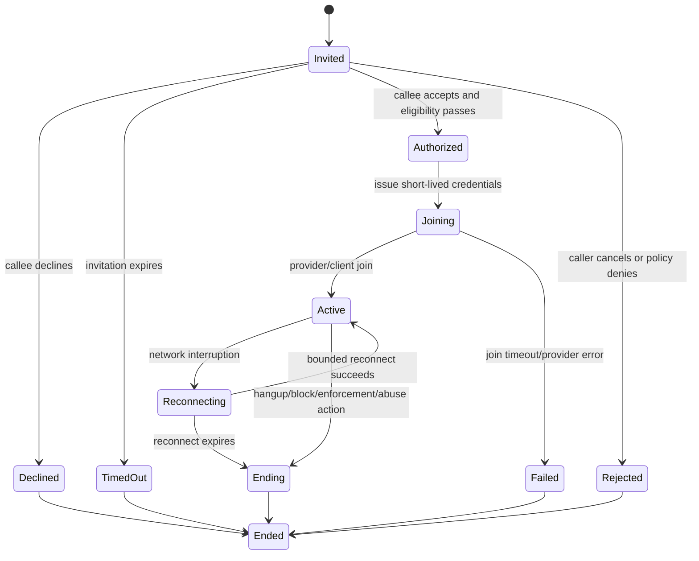

# Realtime voice/video lifecycle

## Purpose

Define future RTC session orchestration. No RTC implementation, recording, or provider is selected.

## Preconditions

Feature is enabled for country/channel; both participants qualify under product policy; caller is session-authenticated; current block/enforcement and connection eligibility pass. Presence alone is not consent to contact.

## Main/alternate flow

REALTIME creates an invitation only after caller and target eligibility/rate checks. Callee explicitly accepts or declines; invitation expires after bounded timeout. On accept, REALTIME revalidates both participants, then creates ephemeral session and short-lived scoped credentials. Provider/client lifecycle signals are verified and reconciled idempotently. Bounded reconnect rechecks credential/session/safety state; expiry closes safely. Block, enforcement, or in-call abuse action causes revocation/end attempt, preserves permitted report evidence references, and denies future join. No lifecycle event asserts recording or message persistence.

## Security/concurrency/data

Credentials bind room, participant, role, expiry, and limited permissions. Do not expose IP/address/provider secrets. Use unique session ID, state version and provider event dedupe. Store minimal session/quality metadata; analytics is consent/minimization governed. Rate-limit calls and room creation to mitigate abuse.

## Phase/open questions

Phase 2. `DECISION REQUIRED / LEGAL REVIEW REQUIRED`: provider, invitation/consent design, participant limits, reconnect/timeout values, abuse-report capture, recording policy, regional availability and accessibility. See [REALTIME](../domains/realtime.md), [provider adapters](../architecture/06-provider-adapters.md), [Trust & Safety](../domains/trust-safety.md), [Consumer surfaces](../DOCS_INDEX.md#product-surface-authority).
