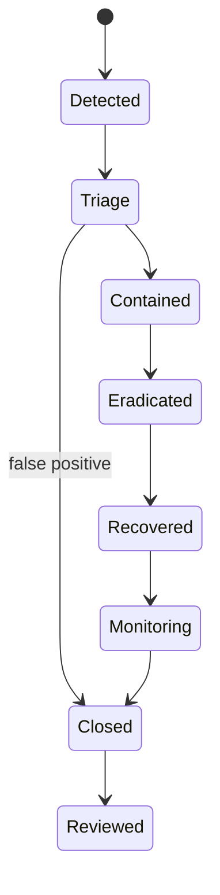

# Incident response

## Purpose and authority

Define minimum response lifecycle for security, privacy, safety, financial, provider, availability, data integrity, AI, and operational incidents. Exact organization, severity, on-call schedule, notification duties, and timelines are `DECISION REQUIRED / LEGAL REVIEW REQUIRED`.

## Incident classes and ownership

Potential classes include account/auth compromise, data exposure, secret leakage, abusive attack, unsafe content/safety event, payment/payout anomaly, entitlement leak, provider/webhook compromise, data corruption/deletion failure, outage/degradation, Admin misuse, AI injection/exfiltration/tool abuse, and compliance gate failure.

One incident commander coordinates; domain owners retain authority for their state. Security/privacy, Trust & Safety/moderation, finance, support/comms, infrastructure, legal/compliance, provider, and executive roles join according to class. Incident tooling does not grant arbitrary domain mutation.

## Lifecycle

Detect and open durable incident record; classify severity/scope/data/countries; assign commander and owners; preserve evidence; contain through scoped feature/route/provider/tool/key/session/access disable; eradicate cause; restore from verified state; reconcile domain/provider outcomes; monitor; notify affected parties/authorities/providers as approved; perform blameless review and tracked remediation.

## Emergency authority

Break-glass access is time-bound, least-privilege, reasoned, separately logged, and reviewed. Use reversible scoped containment before broad destructive action where possible. Emergency feature disable must not erase business/audit evidence or silently bypass refunds, entitlements, safety, deletion, or user-rights obligations.

Secrets are rotated through controlled stores; sessions/tokens are revoked through owner contracts. Financial corrections follow BILLING/PAYOUTS workflows. Enforcement/content action follows safety owner. AI routes/tools/corpora/memory can be suspended, but AI cannot decide incident severity or approve remediation.

## Evidence, communication, and privacy

Incident record captures timeline, decisions, actors, affected systems/domains/providers/countries, evidence references, containment, customer impact, notifications, recovery validation, and follow-up. Keep raw secrets, messages, identity/payment data, media, and safety evidence in restricted stores, not general chat/tickets/logs.

External and user communication is factual, approved, accessible, localized where needed, and avoids unsupported attribution. Regulatory, law-enforcement, customer, creator, partner, or provider notification requires role and legal review according to jurisdiction.

## Readiness and testing

Before launch define severity matrix, paging, escalation, contact lists, provider paths, status communication, backups/restore, forensics access, decision logs, and runbooks for high-risk flows. Exercise account compromise, payment duplication, entitlement leak, data deletion failure, provider outage, Admin misuse, and AI data/tool incident.

## Open decisions and cross-references

`DECISION REQUIRED / LEGAL REVIEW REQUIRED`: severity levels, on-call/commander roles, response and notification timelines, evidence retention, break-glass, external forensics, status page/comms, regulator/provider contacts, tabletop cadence, and post-incident governance.

See [security baseline](../security/01-security-baseline.md), [platform health](05-platform-health.md), [observability](../engineering/04-observability.md), [AI safety](../ai/04-ai-safety-security.md), and [data residency](../compliance/05-data-residency-retention.md).
